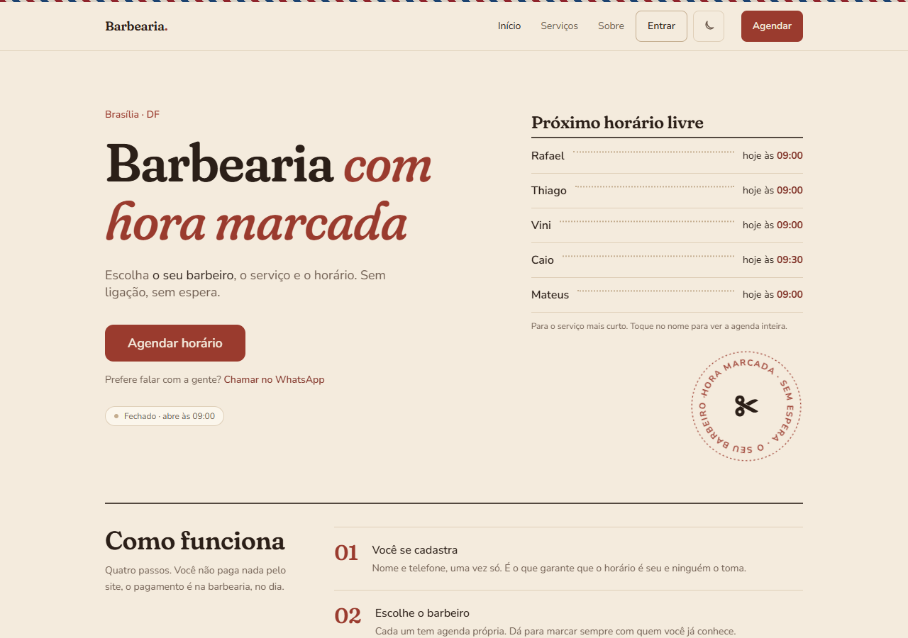
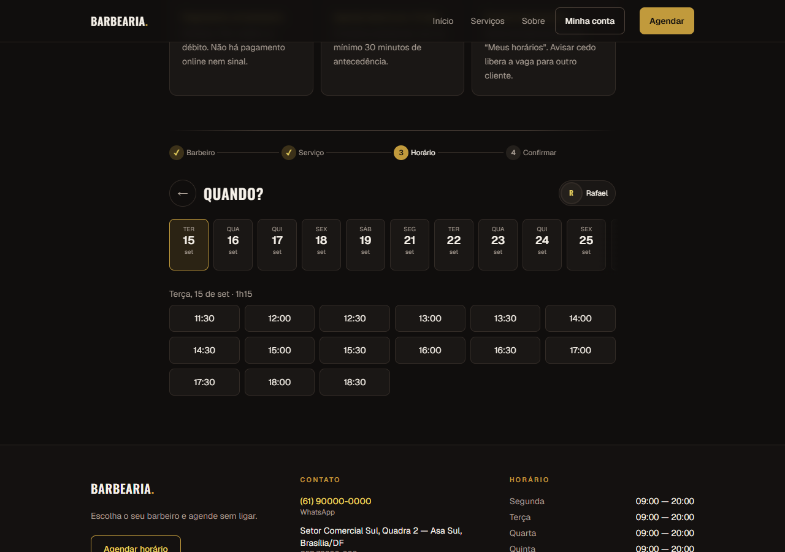
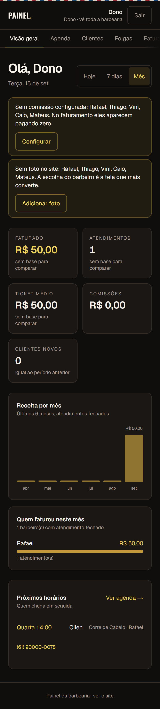
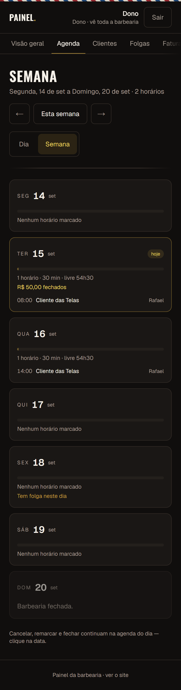

# Sistema de barbearia

Um site próprio para a barbearia, onde o cliente marca horário sozinho — com o barbeiro que ele já conhece — e a barbearia acompanha tudo por um painel: agenda, faturamento, comissões, clientes e folgas.

**Veja funcionando:** https://barbearia.lucas-andrade.dev

É uma demonstração com dados fictícios. Cadastre-se como cliente e marque um horário. Para ver o lado da barbearia, entre no painel com `dono` / `demo-dono-2026`.

## A ideia

A maioria dos apps de agendamento trata a barbearia como uma fila: o cliente escolhe um serviço e pega o primeiro horário livre. Só que quem frequenta barbearia não escolhe a barbearia — escolhe **o barbeiro**. Segue ele no Instagram, volta por causa dele, e quando ele muda de casa, o cliente vai junto.

Este sistema parte daí. Cada barbeiro tem a sua agenda, a sua página e o seu link para colar na bio. O cliente escolhe primeiro a pessoa, depois o serviço, depois o horário — e só vê horários em que aquele serviço cabe de verdade na agenda daquele barbeiro. Dois clientes nunca pegam o mesmo horário, nem clicando ao mesmo tempo.

Do outro lado do balcão, o painel é feito para ser usado de pé, no celular, entre um corte e outro: quem chega em seguida, quanto entrou hoje, quanto cada barbeiro tem a receber, quem não aparece há tempo. Folga, feriado e bloqueio de agenda em dois toques. No fim do mês, o faturamento sai em planilha para o contador.

Sem pagamento online e sem marketplace mostrando o concorrente ao lado: o site é da barbearia.

  
  

## Quer um desses para a sua barbearia?

Estou aberto a contratos para adaptar este sistema ao seu negócio — sua marca, suas cores, seus serviços, seus barbeiros, seu domínio — e para construir o que faltar: integração com WhatsApp, pagamento online, programa de fidelidade, o que fizer sentido para você.

Também atende a outros negócios com hora marcada: salão, estúdio de tatuagem, clínica, consultório.

Fale comigo: **Lucas de Oliveira Andrade** — [lucas-andrade.dev](https://lucas-andrade.dev) · lucasolvrandrade@gmail.com

---

O código-fonte é privado. Este repositório é a apresentação do projeto; a demonstração acima é o sistema completo, rodando.
